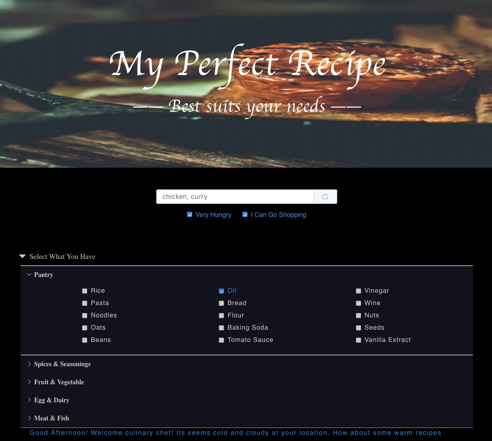
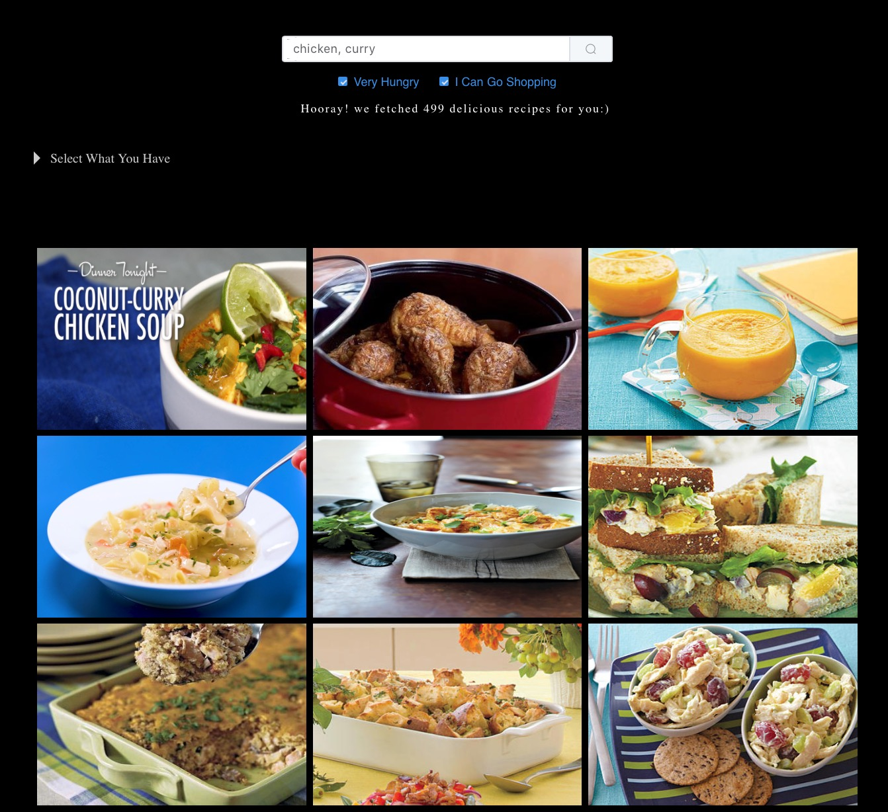

# Recipes Search

The search for the recipe that a person has in mind is an easy one, whilst the search for the recipe that is possible to make given the ingredients available is challenging. The idea behind this project was to implement a recipe search engine that provides the recipe with minimum extra ingredients needed to buy and the least time required to prepare. The recipe suggestion also takes account of the weather in the user’s location, special calendar events and standard diets. This search engine required novel ways of preprocessing and ranking of 102K+ recipes provided on by five of the most popular English language cooking sites.

In this project we performed:
- web crawling
- text preprocessing
- query expansion
- indexing 
- ranking 
- custom search retrivel 
- front-end back-end integration
- user centric designed front end

Please see the "report" folder for more details.

Site landing page:

Selection options:

Displayed Results:

